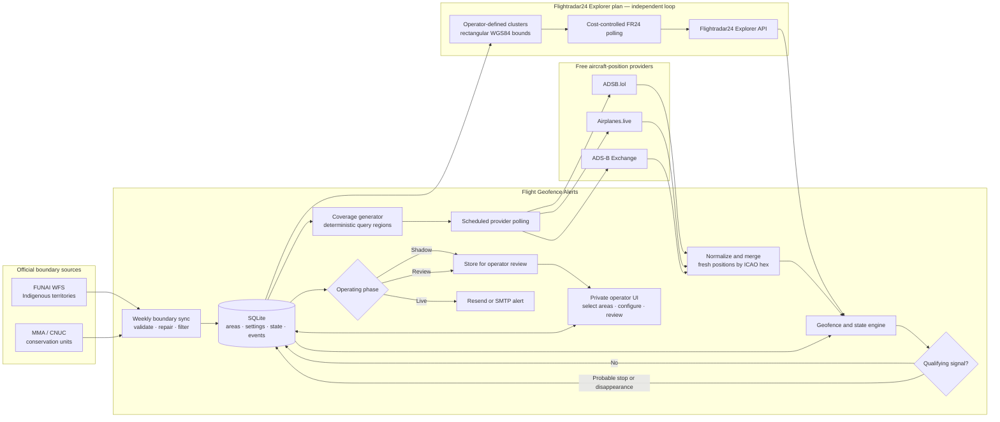

# Flight Geofence Alerts


Detects probable aircraft stops and position loss inside selected protected areas in northern Brazil.

Flight Geofence Alerts is a private, single-operator proof of concept that combines official Brazilian protected-area boundaries with live aircraft-position feeds. It monitors selected Indigenous territories and neighboring conservation units, records potentially relevant aircraft behavior, and supports a controlled progression from silent observation to reviewed email alerts.

> [!CAUTION]
> An event is an **unverified monitoring signal**. It does not prove landing, deliberate transponder shutdown, illegal mining, or wrongdoing. Aircraft feeds are incomplete—especially for low-flying aircraft in areas with limited receiver coverage—and every event requires human corroboration.

**Release:** `v0.8.1` · **Default phase:** `Shadow` · **Default bind:** `127.0.0.1:8080`

## Contents

- [Why this exists](#why-this-exists)
- [What it does](#what-it-does)
- [How it works](#how-it-works)
- [Operating phases](#operating-phases)
- [Quick start](#quick-start)
- [First-run workflow](#first-run-workflow)
- [Boundary data](#boundary-data)
- [Flight providers](#flight-providers)
- [Detection rules](#detection-rules)
- [Configuration](#configuration)
- [Deployment](#deployment)
- [Operations](#operations)
- [Security model](#security-model)
- [Project structure](#project-structure)
- [Testing](#testing)
- [Logs tab — call and observation audit](#logs-tab--call-and-observation-audit)
- [Known limitations](#known-limitations)
- [Troubleshooting](#troubleshooting)
- [Documentation](#documentation)
- [Contributing](#contributing)
- [License](#license)

## Why this exists

Aircraft can play an important role in remote Amazonian logistics, including legitimate health, public-service, community, and commercial operations. They can also be associated with unauthorized extractive activity. General flight-tracking products do not provide a simple, community-controlled workflow for comparing aircraft behavior with Indigenous territories and conservation areas.

This project is intended to answer a narrower question before investing in a larger system:

> **Can available aircraft feeds produce useful, sufficiently low-noise signals inside selected protected areas?**

The PoC helps measure coverage, false positives, provider costs, useful alert patterns, and where community-controlled ADS-B receivers would add the most value.

## What it does

- Downloads current Indigenous-territory polygons from FUNAI's official WFS.
- Discovers and downloads active conservation-unit polygons from MMA/CNUC.
- Refreshes official boundaries weekly and preserves operator selections.
- Includes Indigenous territories intersecting Pará, Amazonas, Amapá, or Roraima, with all administrative phases.
- Includes conservation units intersecting or within a configurable distance of those territories.
- Lets an authenticated operator select exactly which areas to monitor.
- Generates deterministic, overlapping query regions for flight providers.
- Supports free and paid aircraft-position providers behind a common adapter layer.
- Records only two potentially suspicious signals:
  - **probable stop or sustained very low-speed movement**;
  - **position no longer observed after the aircraft was seen inside**.
- Suppresses high-confidence scheduled-airline matches while retaining unknown aircraft as candidates.
- Stores state, events, reviews, configuration, sync health, and delivery status in SQLite.
- Sends alerts through Resend or SMTP only after the operator enables the `Live` phase.
- Runs in a hardened Docker Compose deployment with a private table-first interface.

It intentionally does **not** send routine entry or exit emails, retain complete long-term trajectories, publicly expose live aircraft positions, or make automated accusations.

## How it works



### Data flow in plain language

1. The boundary updater downloads, validates, and filters official FUNAI and CNUC polygons.
2. The operator selects the territories and conservation units to monitor.
3. The application generates provider query regions covering those selected polygons.
4. Enabled free providers are polled on a schedule; Flightradar24 (if enabled) runs an
   independent, cost-controlled polling loop over operator-defined rectangular clusters
   instead of the free-provider query-region grid.
5. Fresh observations are normalized and merged by ICAO 24-bit hex identifier.
6. The state engine compares each aircraft with selected polygons and its prior observations.
7. Only probable-stop and disappearance events are stored.
8. `Shadow` and `Review` keep alerts inside the dashboard; `Live` also sends email.

## Operating phases

| Phase | Real boundaries | Real flight polling | Event recording | Operator review | External email |
|---|---:|---:|---:|---:|---:|
| **Shadow** | Yes | Yes | Yes | Optional | No |
| **Review** | Yes | Yes | Yes | Required for calibration | No |
| **Live** | Yes | Yes | Yes | Recommended | Yes |

### Shadow

The safe default. Use real data without sending alerts outside the application. Start here to validate boundary sync, provider coverage, request volume, and event frequency.

### Review

Operators label events as `useful`, `noise`, or `uncertain`, add notes, adjust thresholds, and narrow area selection. This phase turns initial observations into evidence about whether the system is worth developing further.

### Live

New qualifying events are sent through Resend or SMTP. The interface refuses a transition to Live when required email settings are missing. Returning to Shadow or Review pauses pending retries.

## Quick start

### Requirements

- Docker Engine
- Docker Compose v2
- Approximately 4 GB of free RAM during large boundary processing
- Several GB of disk space for temporary downloads and persistent state

### 1. Configure secrets

```bash
cp .env.example .env
```

Set at least:

```env
ADMIN_PASSWORD=replace-with-a-long-unique-password
APP_SECRET_KEY=replace-with-output-of-openssl-rand-hex-32
```

Generate an application secret:

```bash
openssl rand -hex 32
```

### 2. Start the private deployment

```bash
docker compose up --build -d
```

Open:

```text
http://127.0.0.1:8080
```

The application binds only to localhost by default. For a remote server, use an SSH tunnel or the optional Caddy HTTPS profile.

### 3. Follow startup health

```bash
docker compose ps
docker compose logs -f flight-monitor
```

The first official boundary sync may take several minutes and use substantial memory while processing national datasets.

## Local development with `uv`

For development without Docker, run the app directly with `uv`:

```bash
make dev
```

This starts a hot-reloading server on `http://127.0.0.1:8081`. The `dev` target
overrides `DATABASE_PATH` and `DOWNLOAD_DIR` to local `./data/` paths, because
the `.env` defaults (`/data/runtime/...`, `/data/downloads`) assume Docker
volume mounts that do not exist on the host. To use custom paths, export them
before running:

```bash
DATABASE_PATH=/path/to/flight_alerts.db DOWNLOAD_DIR=/path/to/downloads make dev
```

> [!NOTE]
> The `--reload` watcher monitors the project directory. Because the boundary
> sync writes temporary files to `./data/downloads/`, you may see frequent
> "changes detected" log lines — these are harmless.

## First-run workflow

1. Log in with `ADMIN_PASSWORD`.
2. Wait for the initial official-boundary sync, or select **Sync official boundaries**.
3. Confirm that the sync shows plausible territory and conservation-unit counts.
4. Search and select the areas to monitor.
5. Review the generated query-region count and estimated daily provider requests.
6. Keep the phase set to **Shadow**.
7. Test ADSB.lol—or another configured provider—from Settings.
8. Run a manual coverage poll.
9. Let the system collect events for several days.
10. Move to **Review** and classify events.
11. Tune thresholds, providers, and selected areas based on observed noise.
12. Configure and test email.
13. Move to **Live** only after alerts appear operationally useful.

Command-line equivalents:

```bash
# Force an official-boundary sync
make sync

# Run one flight coverage poll
make poll
```

## Boundary data

### Source fallback chain

The application uses a multi-source fallback chain to ensure reliable boundary data:

**Indigenous territories:**
1. FUNAI WFS `tis_poligonais` (primary, requires browser-like User-Agent header)
2. Last known-good local snapshot (fallback)

**Conservation units:**
1. ICMBio WFS `limiteucsfederais_a` (primary for federal UCs)
2. CNUC via MMA CKAN discovery (fallback for all UCs)
3. RAISG protected areas ArcGIS REST (final fallback)
4. Last known-good local snapshot (emergency)

### FUNAI Indigenous territories

The updater requests the official polygon WFS layer:

```text
https://geoserver.funai.gov.br/geoserver/Funai/ows
```

using `typeName=Funai:tis_poligonais` and `outputFormat=SHAPE-ZIP`. A browser-like User-Agent header is required to avoid 403 errors from the FUNAI server.

### ICMBio Federal conservation units

The updater queries the ICMBio WFS for federal conservation units:

```text
https://geoservicos.inde.gov.br/geoserver/ICMBio/ows
```

using `typeNames=ICMBio:limiteucsfederais_a` and `outputFormat=application/json`.

### MMA / CNUC conservation units

The updater queries the official CKAN package metadata and chooses the newest suitable polygon ZIP resource. If discovery fails, it uses the configured official fallback URL.

### RAISG Protected areas

As a final fallback, the updater queries the RAISG ArcGIS REST service for national protected areas:

```text
https://geo2.socioambiental.org/raisg/rest/services/raisg/raisg_anps_N/MapServer/2/query
```

Note: The RAISG API has a batch size limit of 100 features per request.

### Import safety

Before replacing a healthy dataset, the sync process:

- limits compressed download size, expanded size, and ZIP member count;
- rejects path traversal, symbolic links, and malformed archives;
- validates coordinate systems and polygon geometry;
- repairs invalid geometry where possible;
- requires plausible minimum record counts;
- builds a complete replacement set before modifying the database;
- preserves selections using stable identifiers;
- regenerates deterministic query regions.

Weekly behavior is configurable:

```env
BOUNDARY_SYNC_INTERVAL_DAYS=7
BOUNDARY_SYNC_CHECK_HOURS=6
TARGET_STATES=PA,AM,AP,RR
NEIGHBOR_DISTANCE_KM=10
```

> [!IMPORTANT]
> Weekly checks do not imply that the upstream datasets themselves change weekly. The application checks regularly so that newer official releases are incorporated without manual intervention.

If an automatic sync fails, retries back off exponentially — 1 hour, then 6 hours, then 24 hours —
so a persistent failure cannot burn CPU in a tight loop. The **Sync official boundaries** button and
`POST /api/boundaries/sync` always run immediately, overriding the backoff. Startup also removes
orphaned temporary download folders older than 24 hours (left behind if the process was killed
mid-sync).

## Flight providers

| Provider | Cost model | Key required | Role in this PoC | Important caveat |
|---|---|---:|---|---|
| **ADSB.lol** | Free/open | No | Default source for initial Shadow testing | No published SLA or explicit public production quota |
| **Airplanes.live** | Free public API | No | Optional comparison source | Non-commercial use; app enforces 500 attempts/day |
| **ADS-B Exchange Enterprise** | Paid | Yes | Strong candidate for unfiltered ADS-B, Mode S, and MLAT-style data | Enterprise credentials and terms required |
| **Flightradar24 Explorer plan** | Paid credits, cost-controlled | Yes | Adds broad coverage and route/operator metadata over operator-defined clusters | Runs on its own independent, budget-aware polling loop — see below |

### Multiple free providers

When several free providers are enabled, observations are merged by ICAO hex using the freshest valid position. A disappearance cycle advances only when **every enabled free provider successfully completes the aircraft's last query region**. This intentionally favors fewer false disappearances over faster alerts.

### Configuration examples

ADSB.lol requires no key:

```env
FLIGHT_PROVIDERS=adsb_lol
```

Paid free-grid providers:

```env
FLIGHT_PROVIDERS=adsb_lol,adsbexchange
ADSBEXCHANGE_API_KEY=...
```

Provider credentials can also be saved through the authenticated interface when their matching environment values are blank.

> [!NOTE]
> `flightradar24` is no longer a supported value for `FLIGHT_PROVIDERS`. Its unfiltered, unbounded
> free-grid query path has been retired entirely (it could consume large numbers of credits per
> poll cycle with no cost ceiling) and it has been removed from the provider picker in the
> dashboard. If an existing `.env` still lists it, it is silently skipped each cycle with a
> warning logged rather than blocking the other enabled providers. Flightradar24 is now configured
> exclusively through the Explorer-plan cluster system described next. A retained legacy value in
> `FLIGHT_PROVIDERS` still appears in Settings as a warning chip linking to the FR24 tab.

### Flightradar24 Explorer plan (cost-controlled clusters)

Flightradar24 is billed per API call and per aircraft record returned, so it is deliberately kept
**separate** from the free-provider query-region grid. Instead of following the same polygon-derived
regions as the free providers, the operator defines one or more rectangular **clusters** (via the
FR24 tab in the dashboard, or the `/api/fr24/clusters` API) — up to `FR24_MAX_ACTIVE_CLUSTERS`
(2 by default) enabled at once: a name, a buffer distance around selected areas (or manually
entered WGS84 bounds), altitude range, and aircraft categories.

Key properties of this integration:

- **Independent polling loop.** FR24 clusters are polled on their own schedule
  (`FR24_POLL_INTERVAL_SECONDS`), fully decoupled from the free-provider grid's coverage cycle, under
  its own cross-process lock. The two systems do not merge into one combined observation set: when
  an aircraft is already being freshly tracked by a free provider, the FR24 loop defers to that
  claim instead of overriding it, rather than always preferring whichever reading is newest.
- **Cost-controlled by design.** Routine polling uses only the Light positions endpoint
  (1 credit if the response is empty, otherwise `6 × aircraft returned`). The Count endpoint is
  called only exceptionally, throttled to once per hour per cluster, when a cluster's response is
  possibly truncated by the configured record limit. Summary Full (enrichment) costs more per call
  and is used sparingly — only for new candidate aircraft entering a monitored area, and only when
  `FR24_FETCH_SUMMARY_ON_ENTRY` is enabled. A failed Summary Full enrichment is tried at most three
  times per episode, retrying after one and two poll cycles before giving up. Full flight history
  (Tracks) is the most
  expensive endpoint (40 credits per returned flight) and is fetched **only** through an explicit,
  authenticated manual action on an event — never automatically. The action previews the estimated
  cost before invocation and requires confirmation; it refuses events without a Flightradar24 ID,
  refuses duplicate downloads for as long as the track is retained (a second request never spends
  the cost twice), is blocked when `FR24_BUDGET_POLICY=pause_fr24` has paused FR24 at full budget,
  and records who initiated it in the audit log. The retired `FR24_FETCH_TRACK_ON_EVENT`
  automation flag was removed: deployments that still set it to any nonblank value now **fail
  startup validation loudly by design** — remove the variable from your environment/`.env`;
  manual Tracks need no enable flag.
- **Budget guardrails.** A configurable monthly credit budget (`FR24_MONTHLY_OPERATING_BUDGET`) is
  tracked against actual usage. At 70%+ of budget the scheduler suppresses non-essential calls
  (enrichment, daily usage-sync); at 85%+ and 95%+ it logs escalating warnings. `FR24_BUDGET_POLICY`
  controls what happens once budget is fully exhausted (100%+) — `pause_fr24` (the default) stops
  the FR24 cycle entirely until the next billing period, an actual hard ceiling out of the box.
  Two alternatives remain selectable through the interface (a stored value always survives, and
  an environment setting locks the control): `warn_only` keeps polling at 100% and only logs;
  `continue_until_provider_rejects` keeps polling regardless and relies on Flightradar24's own API
  to start rejecting requests. Spend is evaluated at the start of each cycle, so a budget reached
  mid-cycle lets that cycle finish and pauses starting with the next one.
- **Data retention.** By default, FR24-derived events and aircraft state are retained
  indefinitely — auto-deletion is off (`FR24_AUTO_DELETE_ENABLED=false`). FLIGHTRADAR_API.md sec.
  17 requires deleting Flightradar24 data within 30 days unless a written agreement exists; this
  deployment's operator has confirmed governmental authority (environmental/Indigenous-land
  enforcement mandate) to retain the data indefinitely, which is that written-agreement exception.
  Setting `FR24_AUTO_DELETE_ENABLED=true` re-enables deletion for deployments without that
  authority: FR24 *events* are deleted after `FR24_RETENTION_DAYS` (capped at 29 days), and FR24
  *aircraft state* rows are cleaned up under the same general `STATE_RETENTION_DAYS` (default 14
  days) window used for every other provider's stale state. The FR24 dashboard shows three distinct
  rows: FR24 events are indefinite while auto-delete is off and otherwise use `min(FR24_RETENTION_DAYS, 29)`;
  FR24 outside state is indefinite while auto-delete is off and otherwise uses `STATE_RETENTION_DAYS`; free-provider
  outside state always uses `STATE_RETENTION_DAYS`.

```env
FR24_ENABLED=true
FLIGHTRADAR24_API_KEY=...
FR24_POLL_INTERVAL_SECONDS=300
FR24_MONTHLY_OPERATING_BUDGET=28000
FR24_BUDGET_POLICY=pause_fr24
FR24_AUTO_DELETE_ENABLED=false
```

See `.env.example` for the complete list of `FR24_*` settings, and the FR24 tab in the dashboard
for cluster management, live status, and a manual connection test.

## Detection rules

### Investigation links

All external URLs in emails and the dashboard are generated by a centralized link builder in `app/links.py`. Direct URL construction in templates, email renderers, or frontend JS is prohibited.

| Field | Required identifier | Primary external link | Secondary | No-link condition |
|---|---|---|---|---|
| ICAO hex | Six hex characters | FlightAware aircraft page (registration known) · observing provider's globe (no registration) | Remaining globes; only without registration, then FlightAware live hex lookup | Invalid or `~` target |
| Registration | Valid registration | ANAC RAB (Brazilian civil) | Flightradar24 | Missing or invalid |
| Callsign | Valid ICAO callsign | FlightAware | — | Invalid |
| Flight number | Explicit provider flight number | Flightradar24 | — | Not explicitly available |
| Aircraft type | ICAO type designator | Plain text only | Generic ICAO reference | Always plain text |
| Position | Valid latitude/longitude | Google Maps | OpenStreetMap | Missing/out of range |
| Brazilian airport | ICAO code (starts with S) | AISWEB | FlightAware, OurAirports | Name only |
| Airport with IATA | IATA code | Flightradar24 | — | Missing code |
| Protected area | Internal area ID | Internal app page | Verified source URL | Missing internal record |
| Provider | Known provider ID | Provider homepage | — | Unknown provider |

The `DASHBOARD_BASE_URL` environment variable enables a canonical event link (`/events/{event_id}`) as the primary CTA in alert emails.

### Probable stop

Default requirements:

- inside at least one selected polygon;
- not matched by the high-confidence scheduled-airline heuristic;
- at least three fresh inside observations;
- ground status or ground speed no greater than `20 kt`;
- movement remains within `500 m`;
- qualifying low-speed condition lasts at least `120 seconds`;
- one probable-stop event per aircraft episode.

The low-speed timer begins only with a qualifying observation and resets after high-speed movement, excessive displacement, or a long observation gap.

### Disappearance

Default requirements:

- last fresh position was inside a selected polygon;
- at least two inside observations;
- no high-confidence scheduled-airline match;
- last altitude no greater than `6,000 ft MSL`, or altitude unavailable;
- aircraft absent for three complete successful coverage cycles of its last region;
- one disappearance event per aircraft episode.

Provider failures never count as aircraft disappearance. Two fresh outside observations are required to close an episode, reducing boundary jitter.

### “Non-commercial” is a heuristic

ADS-B does not provide an authoritative legal or business classification. The app suppresses high-confidence scheduled-airline matches using configurable callsign prefixes, operator information, and airliner type codes. Unknown aircraft remain candidates.

The interface therefore uses **non-airline candidate**—not “illegal aircraft,” “garimpo aircraft,” or a definitive “non-commercial flight” label.

## Configuration

Configuration follows this precedence:

1. nonblank environment value;
2. value saved through the authenticated interface;
3. application default.

Environment-controlled values appear locked in the UI. Secrets entered in the interface are encrypted using `APP_SECRET_KEY` and are never returned to the browser.

> [!WARNING]
> Preserve `APP_SECRET_KEY` in backups. Changing it makes previously stored interface secrets unreadable.

### Minimum environment

```env
ADMIN_PASSWORD=...
APP_SECRET_KEY=...
```

### Resend

```env
EMAIL_PROVIDER=resend
RESEND_API_KEY=re_...
EMAIL_FROM=Flight Monitor <alerts@your-verified-domain.org>
ALERT_RECIPIENTS=luandro@gmail.com
```

Use a verified sending domain. The application supplies a stable idempotency key per event and retries failed delivery with bounded backoff.

### SMTP

```env
EMAIL_PROVIDER=smtp
EMAIL_FROM=your-address@gmail.com
SMTP_HOST=smtp.gmail.com
SMTP_PORT=587
SMTP_USERNAME=your-address@gmail.com
SMTP_PASSWORD=your-google-app-password
SMTP_STARTTLS=true
ALERT_RECIPIENTS=luandro@gmail.com
```

Use a Google app password rather than a normal account password.

See [`.env.example`](.env.example) for every option and its safe default.

## Deployment

### Private/local deployment

The safest default is localhost-only:

```bash
make up
```

For a remote host, use an SSH tunnel:

```bash
ssh -L 8080:127.0.0.1:8080 user@server
```

Then browse to `http://127.0.0.1:8080` locally.

### Public HTTPS with Caddy

Set:

```env
DOMAIN=monitor.example.org
SESSION_HTTPS_ONLY=true
TRUSTED_HOSTS=monitor.example.org,localhost,127.0.0.1
```

Point the domain at the server, allow TCP ports `80` and `443` plus UDP `443`, then run:

```bash
make public
```

Do not expose the application port directly. The public profile places Caddy in front of the authenticated app and manages HTTPS automatically.

### Container hardening

The app container runs with:

- a non-root user;
- read-only root filesystem;
- all Linux capabilities dropped;
- `no-new-privileges`;
- PID and log limits;
- health and readiness checks;
- persistent named volumes only for runtime data and downloads;
- graceful shutdown and cross-process job locks.

## Operations

### Common commands

```bash
make dev                 # run locally with uv (hot-reload on :8081, local ./data paths)
make up                 # start private/local deployment
make public             # start with Caddy HTTPS profile
make logs               # follow application logs
make sync               # force official-boundary update
make poll               # run one provider coverage cycle
make check              # compile and run tests
make backup             # create an online SQLite backup
make fix-permissions    # repair ownership from an older root-run release
make down               # stop containers
```

Delete all persistent data only when intentionally resetting the PoC:

```bash
docker compose down -v
```

### Backup

```bash
./scripts/backup.sh
```

Choose a destination:

```bash
./scripts/backup.sh backups/flight-geofence.db
```

Back up before upgrading. Do not change `APP_SECRET_KEY` between deployments unless you are intentionally discarding encrypted UI configuration.

### Memory watch

`./scripts/rss_watch.sh` takes a read-only RSS sample of the running prod
container (docker stats/inspect plus a read-only SQLite query for the last
boundary sync) and appends one line to a local, gitignored CSV. During the
issue #4 observation window, sample every ~6 hours for 48-72 hours: flat or
sawtooth usage means no leak (close #4); a monotonic climb excluding
sync-driven spikes confirms a leak. See the script header for the column
layout and the `--csv` override.

### Health endpoints

- `/healthz` confirms that the HTTP process is alive.
- `/readyz` checks SQLite readiness and is used by Docker health checks.

Operational status is also visible in the dashboard, including sync health, poll health, selected-area count, query-region count, estimated request volume, provider configuration, and review totals.

## Security model

- Password-authenticated, single-operator interface.
- Signed `SameSite=Strict` session cookie.
- Optional HTTPS-only session cookie.
- CSRF protection for authenticated state-changing requests.
- Login throttling after repeated failures.
- Host-header allowlist.
- Content Security Policy and defensive browser headers.
- API documentation endpoints disabled.
- Secrets removed from browser responses and logs.
- UI-managed secrets encrypted at rest.
- Hardened non-root container deployment.

This is **not** a multi-user identity or authorization system. Keep it private and do not publish sensitive event data.

For security findings, avoid opening a public issue containing credentials, exact sensitive locations, or live operational data. Contact the maintainer privately through an agreed project channel.

## Project structure

```text
.
├── app/
│   ├── main.py              # FastAPI app, routes, middleware, schedulers
│   ├── auth.py              # login, sessions, throttling, CSRF
│   ├── boundary_sync.py     # official FUNAI/CNUC discovery and import
│   ├── coverage.py          # query-region generation
│   ├── detection.py         # geofence state machine and event rules
│   ├── emailer.py           # Resend/SMTP delivery and retries
│   ├── geofences.py         # in-memory spatial index
│   ├── links.py             # centralized investigation-link builder
│   ├── providers/           # aircraft-provider adapters
│   ├── settings_store.py    # encrypted UI settings and precedence
│   └── static/              # private table-first frontend
├── scripts/
│   ├── backup.sh            # consistent SQLite backup
│   ├── rss_watch.sh         # read-only RSS sampler for issue #4
│   └── check_external_links.py  # optional manual link checker
├── tests/                   # unit and integration tests
├── .github/workflows/ci.yml # compile, test, frontend, Compose, image build
├── .env.example             # complete deployment configuration
├── docker-compose.yml       # private app, optional Caddy, maintenance job
├── Dockerfile               # hardened Python runtime image
├── Caddyfile                # optional public HTTPS proxy
├── docs/
│   ├── SPEC.md              # product and behavior specification
│   ├── RESEARCH.md          # official sources and provider research
│   ├── AUDIT.md             # v0.4 corrective/hardening audit
│   └── VALIDATION.md        # checks completed and external limitations
```

## Testing

Install dependencies with `uv` (include the `dev` extra for `pytest`):

```bash
uv sync --extra dev
```

Run the full local check:

```bash
make check
```

The GitHub Actions workflow additionally validates frontend syntax, Docker Compose configuration, and the container build.

Useful targeted commands:

```bash
uv run python -m pytest
uv run python -m compileall -q app tests
node --check app/static/app.js
docker compose config --quiet
```

### FR24 sandbox testing (live, zero credits)

Flightradar24's API has a sandbox that returns static, schema-identical
responses and consumes no subscription credits — used here to verify the
whole production path (auth headers, every FR24 client function, the real
scheduler cycle, admin API, dashboard) without touching real usage.

```bash
cp .env.sandbox.example .env.sandbox
# paste the SANDBOX key (separate from the production key — Key management
# at https://fr24api.flightradar24.com/key-management) into .env.sandbox
bash scripts/fr24_sandbox_smoke.sh
```

The script starts an isolated compose stack (own project name, volume, and
port 8081 — the production `.env` is replaced, never merged), runs the
`fr24_sandbox`-marked tests against it, scans container logs for key leaks,
and tears everything down (`KEEP=1` leaves it up for manual inspection at
`http://127.0.0.1:8081`). The tests skip automatically when no sandbox key
is configured, so the default suite and CI are unaffected. Caveats and the
two sandbox-only env accommodations live in `FLIGHTRADAR_API.md`
("Sandbox tests").

### FR24 sandbox event simulation (full lifecycle)

Beyond the smoke pass, `tests/test_fr24_sandbox_scenarios.py` drives the live
sandbox stack through every event lifecycle the production pipeline can
produce — discovery, presence/enrichment, a real `DISAPPEARED` through the
actual detection path, a synthetic labeled `PROBABLE_STOP` (the fixture flies
above the stop-speed gate, so a real one can never fire), episode close by
leaving, budget warning, and budget exhaustion + `pause_fr24` skip — then
captures full-page UI screenshots and restores settings.

```bash
# stack already up and smoke-green (KEEP=1 above), then:
bash scripts/fr24_sandbox_simulate.sh
```

What lands in `sandbox-artifacts/` (gitignored): `settings-backup.json`
(pre-run snapshot) and `0N-*.png` (dashboard, areas, events, settings, FR24
tab, event-detail pages). The script logs to stdout rather than to a file;
redirect it yourself (`bash scripts/fr24_sandbox_simulate.sh 2>&1 | tee
sandbox-artifacts/simulate.log`) if you want a transcript. The stack stays up afterwards — the
script prints a UI tour of what to click at `http://127.0.0.1:8081`.

Determinism tip: the background poll loop runs every 300 s regardless
(`FR24_POLL_INTERVAL_SECONDS` is env-locked in `.env.sandbox`). Manual cycles
collide with it safely on a lock and are retried, but for a fully quiet stack
set `FR24_POLL_INTERVAL_SECONDS=86400` in `.env.sandbox` and re-create
(`docker compose -f docker-compose.yml -f docker-compose.sandbox.yml -p
flight-geofence-sandbox up -d`) before simulating. Fixture rotation is
tolerated: the scenarios discover whatever aircraft the sandbox currently
serves and skip with a clear message if none are event-eligible.

## Logs tab — call and observation audit

Detection only tells you what it *found*. The Logs tab tells you what it
**saw**, so a quiet dashboard can be verified rather than trusted.

Two record types share one timeline:

- **Calls** — every HTTP request to every provider, with outcome, status,
  latency, aircraft returned and (for FR24) credits. Failed calls are
  highlighted, which makes a silently degraded provider obvious: a run of
  `429 Too Many Requests` against one region means that region is not being
  covered, even while the poll as a whole still reports success.
- **Observations** — every aircraft the pipeline normalized, *including the
  ones that matched nothing*. Previously an aircraft outside every selected
  area left no trace at all, so a non-finding could not be reviewed after the
  fact. Each row carries the area(s) matched, the airline classification, and
  a plain-language disposition explaining why it did or did not become an
  event (`outside_no_episode`, `inside_continuing`, `stale_position`, …).

Every aircraft row links out to its profile on the tracking platforms —
ADSB.lol, ADS-B Exchange, Airplanes.live, FlightAware, Flightradar24, and the
ANAC registry for Brazilian registrations — so a suspicious hex can be checked
against independent history in one click. Links are built by the validated
builders in `app/links.py` (and their frontend twins); URLs are never
hand-assembled.

Filter by record type, provider, aircraft hex, or "inside protected areas
only". The **Aircraft detections** record type answers "what did we actually
see?" — every observation plus the calls that returned at least one aircraft,
hiding the empty polls. Detections made before per-aircraft logging existed
still appear there as a call row with its count.

Aircraft the provider returned but detection never processed are logged too
(`dropped_stale_or_unusable`, `dropped_malformed_record`). A position older
than `POSITION_MAX_AGE_SECONDS` is discarded while parsing, so without that row
the gap between what FR24 billed for and what detection actually saw would be
invisible. Retention is `LOG_RETENTION_DAYS` (default 90), trimmed on each poll
cycle alongside the other retention windows.

Endpoint and geometry safety: the call log stores a normalized endpoint label
with every numeric path segment removed, because these providers put the
region centre and radius directly in the request path and protected-area
geometry must never be written to logs.

## Known limitations

- Aircraft that emit no usable signal—or are outside all receiver coverage—cannot be detected.
- Low-altitude coverage in the Amazon may be sparse or intermittent.
- “Non-airline candidate” is a heuristic, not an authoritative commercial or legal classification.
- Low speed does not necessarily mean landing.
- Position loss does not establish intent or transponder shutdown.
- Altitude is generally relative to mean sea level, not terrain.
- Official and commercial upstream schemas, quotas, and terms can change independently of this project.
- This remains a single-operator PoC rather than a production incident-response platform.

## Troubleshooting

<details>
<summary><strong>The application refuses to start</strong></summary>

Confirm that `.env` contains nonexample values for both required secrets:

```env
ADMIN_PASSWORD=...
APP_SECRET_KEY=...
```

`APP_SECRET_KEY` must be at least 32 characters. Inspect logs with:

```bash
docker compose logs flight-monitor
```

</details>

<details>
<summary><strong>No protected areas appear</strong></summary>

Run a manual sync and inspect its result:

```bash
make sync
docker compose logs --tail=300 flight-monitor
```

Check outbound connectivity to FUNAI and MMA, available disk space, and memory. A failed or implausibly partial import does not replace an existing healthy dataset.

</details>

<details>
<summary><strong>No aircraft appear</strong></summary>

- Verify that at least one provider is enabled.
- Use the provider test in Settings.
- Confirm selected areas and generated query regions.
- Review provider errors and request estimates.
- Remember that no result may reflect real receiver-coverage limitations rather than an application failure.

</details>

<details>
<summary><strong>Events appear but no email is sent</strong></summary>

- Confirm that the phase is `Live`.
- Verify the email provider, sender, recipient, and key/password.
- Run the email test in Settings.
- For Resend, use a verified sending domain.
- Check the daily email cap and retry status in the event record.

</details>

<details>
<summary><strong>A previous release created root-owned volume files</strong></summary>

Run the one-time maintenance task:

```bash
make fix-permissions
```

Then start normally.

</details>

## Documentation

- [Product specification](docs/SPEC.md)
- [Research and official sources](docs/RESEARCH.md)
- [Security and reliability audit](docs/AUDIT.md)
- [Validation record](docs/VALIDATION.md)
- [Complete environment reference](.env.example)

## Contributing

This is an early research PoC. Before proposing a major feature, open a discussion or issue describing:

- the operational problem;
- how it reduces false positives or improves coverage;
- privacy and security implications;
- provider terms or cost implications;
- how the change can be tested without exposing sensitive locations or events.

For code changes:

1. create a focused branch;
2. keep provider-specific logic behind an adapter;
3. update the specification when behavior changes;
4. add tests for state transitions and failure behavior;
5. run `make check` before submitting a pull request;
6. never commit `.env`, credentials, downloaded sensitive data, or live event exports.

## License

This project is licensed under the [MIT License](LICENSE). See `LICENSE` for the full text.
